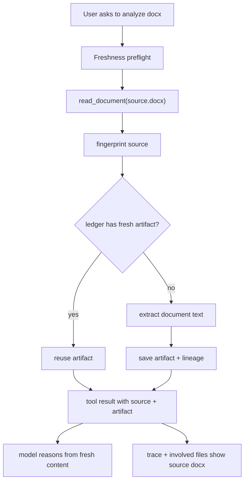

# File Knowledge Lifecycle Design

**Date:** 2026-07-23  
**Status:** Draft for review  
**Scope:** Nexus runtime/tools/storage/monitor; web + desktop UI only for visibility.

## Problem

Nexus currently treats file reads and extracted text as ordinary tool outputs. A turn can read a stale derived file such as `_v1_decoded.txt` that was generated from `_v1.0.docx`, while the source docx has since changed. The agent then reasons from old extracted content without being forced to refresh it.

Existing mechanisms are not enough:

- `read_file` returns content and artifact refs, but not full-file `mtime/size/hash/readAt`.
- `project_checkpoint` stores hashes for rollback of changed files, not for knowledge freshness.
- `turnFileSummary` infers paths from tool calls and command strings, but does not know source → derived artifact lineage.
- Trace has a `file` category, but it does not currently express stale/read/refreshed document knowledge lifecycle.

## Goals

1. Make every file read produce a durable fingerprint: absolute path, workspace-relative path, size, mtime, content hash, observed time, and content type.
2. Track derived document artifacts, especially docx/pdf/xlsx/pptx → text/markdown extraction, with explicit source file fingerprints.
3. Detect stale derived artifacts before the agent can silently rely on them.
4. Make stale/refresh/read events visible in Activity and Run Monitor.
5. Keep the first implementation small enough to ship without building a full RAG/indexing system.

## Non-goals

- No embeddings or semantic search in the MVP.
- No file-system watcher daemon in the MVP.
- No automatic indexing of the whole workspace.
- No hidden background extraction of large files unless the agent or user action asks for that file.
- No attempt to make shell-generated arbitrary files perfectly traceable in MVP; shell command file-path inference remains best-effort.

## Recommended Architecture

### 1. File fingerprint model

Add a shared model in protocol/runtime:

```ts
export interface FileFingerprint {
  path: string;
  relativePath?: string;
  workspaceRoot?: string;
  sizeBytes: number;
  mtimeMs: number;
  sha256: string;
  contentType: string;
  observedAt: string;
}
```

Rules:

- Hash is full-file hash, not excerpt hash.
- For text files, `read_file` still returns excerpt refs, but `data.file` contains the full-file fingerprint.
- Paths shown in UI remain safe workspace-relative when possible; absolute paths are stored for local execution but redacted in trace summaries where needed.

### 2. Document extraction tool

Add a first-class `read_document` or `extract_document` tool instead of asking agents to create ad-hoc `_decoded.txt` files.

Supported MVP types:

- `.docx`
- `.pdf`
- `.xlsx`
- `.pptx`
- fallback text-like files reuse `read_file`

The tool returns:

```ts
{
  source: FileFingerprint;
  artifact: {
    path: ".nexus/artifacts/documents/<hash>.md",
    kind: "document_text",
    sha256: string,
    createdAt: string,
    extractor: "docx-text" | "pdf-text" | "xlsx-text" | "pptx-text",
    extractorVersion: string
  },
  stale: false,
  textPreview: string
}
```

Artifact location:

- Use `.nexus/artifacts/documents/` under the active workspace root.
- Do not generate root-level `_xxx.txt` helper files for normal document extraction.
- If an old helper file is read, the lifecycle layer can flag it as unmanaged or stale if lineage is unavailable.

### 3. Artifact lineage ledger

Persist a lightweight JSON/SQLite-backed ledger. The existing storage backend can own this later, but the first cut can live under workspace `.nexus/artifacts/index.json` behind a runtime service.

```ts
export interface DocumentArtifactRecord {
  artifactPath: string;
  artifactHash: string;
  artifactKind: "document_text";
  sourcePath: string;
  sourceHash: string;
  sourceSizeBytes: number;
  sourceMtimeMs: number;
  extractor: string;
  extractorVersion: string;
  createdAt: string;
  lastUsedAt?: string;
}
```

Rules:

- Reuse artifact only when `sourceHash`, `sourceSizeBytes`, `sourceMtimeMs`, and `extractorVersion` still match.
- If source file exists and any fingerprint field changed, mark artifact stale and refresh before returning text.
- If source file is missing, return a structured stale/missing error instead of pretending the artifact is current.
- If artifact file is missing but ledger exists, re-extract from source when possible.

### 4. Freshness preflight

Before each model iteration, runtime should run a cheap freshness preflight for the current thread:

- Check files explicitly mentioned in the latest user message.
- Check files read in the previous N turns, where N defaults to 3.
- Check all derived artifacts used in the active turn/session.

Output becomes a small context event, not a large content injection:

```ts
{
  staleArtifacts: [
    {
      artifactPath,
      sourcePath,
      reason: "source_hash_changed" | "source_missing" | "artifact_missing" | "unmanaged_artifact"
    }
  ],
  changedFiles: [...]
}
```

If stale artifacts exist:

- The model should see a compact instruction: “Previous extracted content for X is stale; call `read_document` again before relying on it.”
- For direct user requests like “读取这个 docx / 分析这个文件”， the runtime/tool layer may force refresh automatically when `read_document` is called.

### 5. Tool-layer hard guard

`read_file` should not block ordinary text reads. But if it reads a known derived artifact whose source is stale, it should return a warning in `data.freshness`:

```ts
{
  status: "stale",
  sourcePath,
  reason,
  recommendedTool: "read_document"
}
```

For `read_document`, stale source detection is automatic:

- stale existing artifact → refresh and return fresh artifact
- fresh artifact → reuse
- failed extraction → return failed tool result with source fingerprint and reason

This avoids depending on model discipline.

### 6. Checkpoint integration

Project checkpoint should stay focused on rollback. Add only a compact knowledge section, not full content:

```ts
knowledge?: {
  observedFiles: Array<Pick<FileFingerprint, "path" | "sha256" | "mtimeMs" | "sizeBytes">>;
  documentArtifacts: Array<{
    artifactPath: string;
    sourcePath: string;
    sourceHash: string;
    artifactHash: string;
  }>;
}
```

Rollback behavior:

- Existing file rollback semantics stay unchanged.
- After rollback, mark affected document artifacts stale if their source hash no longer matches.
- Do not roll back `.nexus/artifacts` as project source unless explicitly changed by a tool.

### 7. Trace and monitor

Extend `RunTracePayloadMap.file` with optional lifecycle fields:

```ts
file: {
  action: "read" | "write" | "patch" | "delete" | "checkpoint" | "extract" | "stale" | "refresh";
  path: string;
  sourcePath?: string;
  artifactPath?: string;
  sha256?: string;
  staleReason?: string;
  contentType?: string;
}
```

UI behavior:

- Activity list should show file events inline with tool events, not as a separate “resources used” section.
- Monitor timeline should distinguish:
  - file read
  - document extracted
  - artifact reused
  - artifact stale
  - artifact refreshed
  - extraction failed
- Trace inspector should show source hash, artifact hash, extractor, stale reason, and whether the model saw stale warning context.

### 8. Involved files summary

`turnFileSummary` should prefer structured file metadata over regex-parsing command output:

Priority order:

1. tool result `data.file`
2. document result `data.source` and `data.artifact`
3. file_change `changes`
4. command inferred paths as fallback

For docx analysis, the summary should show the source docx as the involved file, not just the generated text artifact.

## Data Flow



## Failure handling

- Source file missing: tool fails with `SOURCE_MISSING`; monitor shows stale/missing.
- Unsupported format: tool fails with `UNSUPPORTED_DOCUMENT_TYPE`; model should ask user for a supported file or use an alternate path.
- Extractor crash: tool fails with `EXTRACTION_FAILED`; include stderr/message but not raw secrets.
- Artifact write failure: return extracted text preview if safe, but mark artifact persistence failed.
- Hash mismatch after extraction: retry once; if still mismatched, fail closed.

## Testing strategy

Core tests:

- `read_file` returns full-file fingerprint.
- `read_document` creates artifact + ledger record for docx fixture.
- `read_document` reuses artifact when source hash is unchanged.
- `read_document` refreshes artifact when source file changes.
- reading a stale artifact through `read_file` returns a freshness warning.
- `turnFileSummary` shows source docx as involved file.
- trace projector counts extract/stale/refresh file events.
- checkpoint knowledge section records compact file/artifact fingerprints.

Browser/UI tests:

- Monitor timeline renders document extracted/stale/refreshed events.
- Activity panel recent events include file lifecycle events with agent/tool context.

## Implementation boundaries

Likely files:

- `packages/protocol/src/types.ts`
- `packages/protocol/src/runTrace.ts`
- `packages/protocol/src/runTraceSchemas.ts`
- `packages/tools/src/builtin.ts`
- `packages/tools/src/builtin.test.ts`
- `packages/runtime/src/agent.ts`
- `packages/runtime/src/agent.test.ts`
- `apps/web/src/features/chat/turnFileSummary.ts`
- `apps/desktop/src/features/chat/turnFileSummary.ts`
- `apps/web/src/components/monitor/*`
- `apps/desktop/src/components/monitor/*`

## MVP acceptance criteria

The MVP is done when this scenario is impossible:

1. User asks Nexus to analyze `A.docx`.
2. Nexus extracts it to a text artifact.
3. User modifies `A.docx`.
4. User asks Nexus to analyze it again.
5. Nexus silently reads the old artifact and answers from stale content.

Correct behavior:

- Nexus detects source hash changed.
- Nexus refreshes extraction or warns/fails closed.
- The involved files summary shows `A.docx`.
- Monitor shows stale detection and refresh.

## Open decision

The only product decision left before implementation:

- Should `read_file` block stale derived artifacts outright, or return the stale content with a high-visibility warning?

Recommended default: fail closed for known stale managed artifacts, warn for unmanaged helper files. This prevents silent bad answers while keeping old ad-hoc files inspectable.
