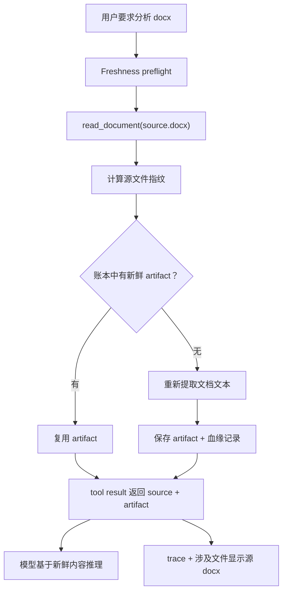

# 文件 / 知识生命周期设计

**日期：** 2026-07-23  
**状态：** 待审阅草案  
**范围：** Nexus runtime / tools / storage / monitor；web + desktop UI 只做可视化呈现。

## 问题

Nexus 现在把文件读取和提取后的文本都当作普通工具输出处理。这样会出现一个严重问题：某一轮先把 `_v1.0.docx` 提取成 `_v1_decoded.txt`，后来用户修改了 `_v1.0.docx`，下一轮 Agent 仍然可能直接读取旧的 `_v1_decoded.txt`，然后基于过期内容回答。

现有机制不够：

- `read_file` 返回文本和 artifact refs，但没有返回完整文件的 `mtime / size / hash / readAt`。
- `project_checkpoint` 主要用于回滚已修改文件，不用于判断“知识是否新鲜”。
- `turnFileSummary` 主要从 tool call 和 command 字符串里猜路径，不知道“源文件 → 派生产物”的关系。
- Trace 已经有 `file` 分类，但还没有表达“读取 / 提取 / 过期 / 刷新”的文件知识生命周期。

## 目标

1. 每次文件读取都生成可靠指纹：绝对路径、workspace 相对路径、大小、mtime、内容 hash、观察时间、内容类型。
2. 跟踪文档派生产物，尤其是 docx / pdf / xlsx / pptx → text / markdown 的提取结果，并记录源文件指纹。
3. 在 Agent 静默依赖旧内容前检测出 stale。
4. 在活动栏和运行监控里展示读取、提取、过期、刷新事件。
5. 第一版不做完整 RAG / embeddings / 全局索引，先解决当前“旧提取物误用”的正确性问题。

## 非目标

- MVP 不做 embeddings 或语义搜索。
- MVP 不做文件系统 watcher 常驻监听。
- MVP 不自动索引整个 workspace。
- 除非用户或 Agent 明确请求某个文件，不在后台偷偷提取大型文件。
- MVP 不保证能完美追踪 shell 命令临时生成的任意文件；shell command 路径推断仍然只是兜底。

## 推荐架构

### 1. 文件指纹模型

在 protocol / runtime 层增加共享模型：

```ts
export interface FileFingerprint {
  path: string;
  relativePath?: string;
  workspaceRoot?: string;
  sizeBytes: number;
  mtimeMs: number;
  sha256: string;
  contentType: string;
  observedAt: string;
}
```

规则：

- `sha256` 必须是完整文件 hash，不是片段 hash。
- 文本文件仍由 `read_file` 返回片段内容，但 `data.file` 里要带完整文件指纹。
- UI 展示优先用 workspace 相对路径；本地执行可以保存绝对路径，但 trace summary 里需要按现有规则脱敏 / 收敛。

### 2. 文档提取工具

新增一等工具：`read_document` 或 `extract_document`。不要再让 Agent 随手写 `_decoded.txt` 这种 ad-hoc 文件。

MVP 支持：

- `.docx`
- `.pdf`
- `.xlsx`
- `.pptx`
- 文本类文件继续走 `read_file`

工具返回：

```ts
{
  source: FileFingerprint;
  artifact: {
    path: ".nexus/artifacts/documents/<hash>.md",
    kind: "document_text",
    sha256: string,
    createdAt: string,
    extractor: "docx-text" | "pdf-text" | "xlsx-text" | "pptx-text",
    extractorVersion: string
  },
  stale: false,
  textPreview: string
}
```

产物位置：

- 统一写到当前 workspace 下的 `.nexus/artifacts/documents/`。
- 正常文档提取不再生成 workspace 根目录里的 `_xxx.txt`。
- 如果读取到旧 helper 文件，生命周期层可以标记它为 unmanaged；如果能识别血缘则进一步判断 stale。

### 3. 派生产物血缘账本

持久化轻量账本。后续可以接入现有 storage backend；第一版可以先在 runtime service 后面使用 workspace 内 `.nexus/artifacts/index.json`。

```ts
export interface DocumentArtifactRecord {
  artifactPath: string;
  artifactHash: string;
  artifactKind: "document_text";
  sourcePath: string;
  sourceHash: string;
  sourceSizeBytes: number;
  sourceMtimeMs: number;
  extractor: string;
  extractorVersion: string;
  createdAt: string;
  lastUsedAt?: string;
}
```

规则：

- 只有 `sourceHash`、`sourceSizeBytes`、`sourceMtimeMs`、`extractorVersion` 都匹配时才复用 artifact。
- 如果源文件存在但任意指纹字段变化，标记 artifact stale，并在返回内容前刷新。
- 如果源文件不存在，返回结构化 stale / missing 错误，不能假装 artifact 仍然可信。
- 如果账本存在但 artifact 文件丢了，只要源文件还在，就重新提取。

### 4. Freshness preflight

每次模型迭代前，runtime 做一次轻量 freshness preflight：

- 检查最新用户消息里明确提到的文件。
- 检查最近 N 轮读过的文件，默认 N = 3。
- 检查当前 turn / session 用过的所有派生产物。

输出是小型 context event，不注入大段文件内容：

```ts
{
  staleArtifacts: [
    {
      artifactPath,
      sourcePath,
      reason: "source_hash_changed" | "source_missing" | "artifact_missing" | "unmanaged_artifact"
    }
  ],
  changedFiles: [...]
}
```

如果发现 stale：

- 给模型注入简短提示：“X 的旧提取内容已经过期，依赖它前必须重新调用 `read_document`。”
- 对“读取这个 docx / 分析这个文件”这类直接请求，`read_document` 自己负责自动刷新。

### 5. 工具层硬保护

`read_file` 不应该阻止普通文本读取。但如果它读到的是已知托管派生产物，并且源文件 stale，就应该在 `data.freshness` 里返回警告：

```ts
{
  status: "stale",
  sourcePath,
  reason,
  recommendedTool: "read_document"
}
```

`read_document` 的行为更严格：

- 已有 artifact 新鲜 → 复用。
- 已有 artifact stale → 自动刷新后返回。
- 提取失败 → 返回 failed tool result，并带源文件指纹和失败原因。

这样不依赖模型“自觉记得重新读”。

### 6. Checkpoint 集成

`project_checkpoint` 仍然专注回滚，不塞完整文档内容。只增加紧凑知识摘要：

```ts
knowledge?: {
  observedFiles: Array<Pick<FileFingerprint, "path" | "sha256" | "mtimeMs" | "sizeBytes">>;
  documentArtifacts: Array<{
    artifactPath: string;
    sourcePath: string;
    sourceHash: string;
    artifactHash: string;
  }>;
}
```

回滚行为：

- 现有文件回滚语义不变。
- 回滚后，如果影响到某个文档 artifact 的源文件 hash，就把该 artifact 标记 stale。
- `.nexus/artifacts` 不作为普通项目源码回滚，除非某个工具明确修改了它。

### 7. Trace 和监控

扩展 `RunTracePayloadMap.file`：

```ts
file: {
  action: "read" | "write" | "patch" | "delete" | "checkpoint" | "extract" | "stale" | "refresh";
  path: string;
  sourcePath?: string;
  artifactPath?: string;
  sha256?: string;
  staleReason?: string;
  contentType?: string;
}
```

UI 行为：

- 活动栏里的最近事件直接显示文件事件，不再单独搞一个“资源使用”列表。
- 运行监控 timeline 区分：
  - file read
  - document extracted
  - artifact reused
  - artifact stale
  - artifact refreshed
  - extraction failed
- Trace inspector 显示源 hash、artifact hash、extractor、stale 原因，以及模型是否收到了 stale warning context。

### 8. 涉及文件摘要

`turnFileSummary` 应优先使用结构化文件元数据，不再优先靠 regex 猜 command 输出。

优先级：

1. tool result `data.file`
2. document result `data.source` 和 `data.artifact`
3. file_change `changes`
4. command 推断路径兜底

对 docx 分析来说，“涉及文件”应该显示源 docx，而不是只显示生成出来的 txt / md artifact。

## 数据流



## 失败处理

- 源文件不存在：tool 返回 `SOURCE_MISSING`；监控显示 stale / missing。
- 格式不支持：tool 返回 `UNSUPPORTED_DOCUMENT_TYPE`；模型应要求用户换支持文件或选择替代读取方式。
- 提取器崩溃：tool 返回 `EXTRACTION_FAILED`；可带错误信息，但不能暴露敏感数据。
- artifact 写入失败：如果安全，可以返回提取文本预览，但标记 artifact 持久化失败。
- 提取后 hash 不一致：重试一次；仍不一致就 fail closed。

## 测试策略

核心测试：

- `read_file` 返回完整文件指纹。
- `read_document` 能为 docx fixture 创建 artifact + ledger record。
- 源文件 hash 未变时，`read_document` 复用 artifact。
- 源文件变化后，`read_document` 刷新 artifact。
- 通过 `read_file` 读取 stale artifact 时返回 freshness warning。
- `turnFileSummary` 对文档分析显示源 docx。
- trace projector 能统计 extract / stale / refresh 文件事件。
- checkpoint knowledge section 记录紧凑文件 / artifact 指纹。

浏览器 / UI 测试：

- Monitor timeline 能渲染 document extracted / stale / refreshed。
- Activity 面板最近事件能显示文件生命周期事件，并带 agent / tool 上下文。

## 实现边界

大概率涉及文件：

- `packages/protocol/src/types.ts`
- `packages/protocol/src/runTrace.ts`
- `packages/protocol/src/runTraceSchemas.ts`
- `packages/tools/src/builtin.ts`
- `packages/tools/src/builtin.test.ts`
- `packages/runtime/src/agent.ts`
- `packages/runtime/src/agent.test.ts`
- `apps/web/src/features/chat/turnFileSummary.ts`
- `apps/desktop/src/features/chat/turnFileSummary.ts`
- `apps/web/src/components/monitor/*`
- `apps/desktop/src/components/monitor/*`

## MVP 验收标准

MVP 完成后，下面这种情况不能再发生：

1. 用户让 Nexus 分析 `A.docx`。
2. Nexus 把它提取成文本 artifact。
3. 用户修改 `A.docx`。
4. 用户再次让 Nexus 分析它。
5. Nexus 静默读取旧 artifact，并基于旧内容回答。

正确行为：

- Nexus 检测到源文件 hash 已变化。
- Nexus 自动刷新提取物，或者明确警告 / fail closed。
- 涉及文件摘要显示 `A.docx`。
- 监控显示 stale detection 和 refresh。

## 剩余产品决策

实现前只剩一个产品决策：

- `read_file` 读到 stale 派生产物时，是直接阻止，还是返回旧内容但强提示？

推荐默认：

- 已知托管 artifact stale：fail closed，禁止静默使用。
- 非托管旧 helper 文件：允许读取，但高亮警告。

这个默认能防止错误回答，同时还能让旧的临时文件可被人工检查。
