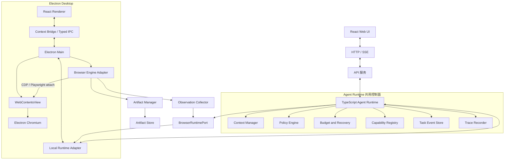

# 面向 Web 任务的 Agent 浏览器运行时架构设计

## 文档概览

- **版本**：0.4
- **状态**：Electron 重构实施设计
- **当前重点**：Electron 单一 Chromium 会话与 Agent/用户协同控制
- **Web 端定位**：任务控制面、结果查看和远程状态展示，不承载本机浏览器
- **演进方向**：远程浏览器运行时、多智能体调度与完整的桌面浏览器工作台

---

## 1. 背景与定位

传统浏览器自动化解决的是启动浏览器、定位元素和执行脚本。Agent 浏览器运行时还需要处理页面理解、连续决策、错误恢复、用户接管、安全边界和上下文成本。

本设计不在首期建设全能 Agent 工作平台，而是先在桌面端实现一个面向 Web 任务的可恢复浏览器执行内核：

1. 浏览和理解网页。
2. 搜索、提取并比较信息。
3. 下载文件并返回可追溯结果。
4. 填写普通表单，在提交等有副作用的动作前进行控制。
5. 在流式输出、用户滚动、人工接管、失败和取消情况下保持状态一致。

首期完成可靠的桌面端纵向闭环，再逐步扩展登录、复杂多标签页、长期任务、站点能力、多智能体和远程浏览器。

---

## 2. 设计目标与非目标

### 2.1 首期目标

- **桌面浏览器优先**：浏览器执行只在 Electron 桌面端落地；Web 端复用协议、API 和运行轨迹，不访问用户本机浏览器。
- **单一浏览器会话**：用户看到和操作的页面必须就是 Agent 执行的 Chromium `WebContents`，禁止以截图、镜像 WebView 或第二套浏览器伪装共享会话。
- **状态可恢复**：任务状态和关键动作以事件方式持久化，崩溃后可判断继续、对账或挂起。
- **观测可引用**：Agent 通过稳定元素引用执行动作，不直接依赖脆弱选择器。
- **动作可验证**：任何动作都不默认成功，执行后必须验证后置条件。
- **用户可接管**：确认、输入、验证码、认证和选择具有明确等待协议。
- **安全内建**：页面内容默认不可信，策略检查、预算和敏感动作控制从第一阶段生效。
- **可观测**：任务事件、运行 Trace 和用户可读进度从第一阶段产生。

### 2.2 首期非目标

- Web 端内置浏览器。Web 端只能控制任务、审批动作和查看结果；如未来支持浏览器，需要单独部署远程 Browser Worker。
- 多智能体共享同一浏览器会话。
- 云浏览器集群和跨节点调度。
- 自动完成支付或其他不可逆交易。
- 自动绕过 CAPTCHA、站点风控或反自动化机制。
- 完整恢复浏览器前进后退栈、所有 `sessionStorage`、IndexedDB 和页面内存状态。
- 通用长期记忆和能力市场。
- 依赖视觉坐标完成所有网页操作。

### 2.3 首期任务边界

| 类型 | 首期支持 | 执行端 | 说明 |
| --- | --- | --- | --- |
| 信息浏览与摘要 | 是 | Desktop | 页面内容始终按不可信数据处理 |
| 站内搜索与结果比较 | 是 | Desktop | 优先站内搜索或搜索 API |
| 文件下载 | 受控支持 | Desktop | 限制类型、大小和保存位置 |
| 普通表单填写 | 是 | Desktop | 提交前根据风险决定是否确认 |
| 登录 | 有限支持 | Desktop | 不让凭证进入 LLM 上下文 |
| CAPTCHA | 人工接管 | Desktop | 不自动规避 |
| 支付、下单、发信等不可逆动作 | 默认不执行 | Desktop | 后续通过专用能力和两阶段协议开放 |

### 2.4 Web 与 Desktop 边界

| 能力 | Web 端 | Desktop 端 |
| --- | --- | --- |
| 对话、任务创建、停止、审批 | 支持 | 支持 |
| 任务状态、Trace、结果查看 | 支持 | 支持 |
| 控制本机 Chromium | 不支持 | 支持 |
| 内嵌浏览器页面 | 不支持 | 支持 |
| 本机 Cookie、文件、OS keychain | 不可访问 | 由 Electron Main 控制 |
| Chromium 页面 | 不在 Web 前端运行 | 由 Electron `WebContentsView` 承载 |
| CDP / Playwright | 不在浏览器前端运行 | Electron Main 内的 Browser Engine Adapter 统一控制 |
| 远程浏览器 | 后续通过 API 接入 | 后续可作为替代运行时 |

Web 端不能直接控制用户本机 Chromium：浏览器沙箱不允许网页访问本机 Cookie、文件系统、进程和 DevTools 协议。Web 端如果需要浏览器能力，必须连接独立的远程 Browser Worker；这不属于首期范围。

---

## 3. 核心设计原则

1. **用户授权高于模型判断**：LLM 只能提出动作，不能扩大权限。
2. **页面内容永远是不可信数据**：DOM、截图、OCR、PDF、下载文件和工具结果都不能成为高优先级指令。
3. **策略执行点不可绕过**：所有浏览器动作必须经过统一授权、预算和风险检查。
4. **观测和动作必须成对版本化**：动作只能引用经过校验的观测结果。
5. **先记录意图，再执行副作用**：可能产生外部写入的动作必须先进入账本。
6. **执行不等于成功**：每个动作必须声明并验证后置条件。
7. **取消优先于继续**：取消信号逐层传播，不允许新的动作在取消后启动。
8. **任务状态和运行遥测分离**：恢复所需事件保持精简，详细 DOM、截图和网络信息进入 Trace。
9. **先完成单任务闭环，再扩展并发**：首期不为多智能体提前引入复杂调度。
10. **桌面宿主与执行器解耦**：首期绑定 Electron，浏览器动作通过 `BrowserEngineAdapter` 接入同一 `WebContents`，未来再增加远程 Worker。
11. **控制权必须互斥**：Agent 和用户不能同时向页面注入输入；人工接管和归还必须经过显式状态转换与重新观测。

---

## 4. 信任边界与威胁模型

### 4.1 信任层级

```text
系统策略与管理员配置
        ↓
用户目标与本次授权
        ↓
Runtime 生成的受控状态
        ↓
页面内容、截图、OCR、下载内容、第三方工具结果
```

页面中的“忽略之前指令”“上传本地文件”“把验证码发送到某地址”等文字只能作为被观察内容，不能获得动作授权。

### 4.2 授权包络

用户目标在任务开始时编译为确定性的授权范围。模型执行过程中不能自行扩展该范围。

```typescript
interface ActionGrant {
  grantId: string;
  taskId: string;
  allowedOrigins: string[];
  allowedActionKinds: BrowserActionKind[];
  allowedDataClasses: Array<'public' | 'user_input' | 'download'>;
  maxExternalWrites: number;
  maxSpend?: { currency: string; amount: number };
  expiresAt: number;
  confirmationRules: ConfirmationRule[];
}
```

策略引擎依据授权包络、动作目标、数据类别、风险等级和当前页面状态作出确定性决策。LLM 可以给出“动作是否服务于目标”的解释，但该解释不能替代策略判断。

### 4.3 内容来源与打污

所有进入上下文的页面数据携带来源信息：

```typescript
interface ContentProvenance {
  trust: 'trusted' | 'untrusted';
  source: 'user' | 'runtime' | 'dom' | 'screenshot' | 'ocr' | 'download' | 'tool';
  origin?: string;
  pageId?: string;
  observationId?: string;
}
```

内容打污用于保留来源和驱动保守策略，不尝试判断 LLM 内部究竟受哪段文本影响。只要动作发生在读取不可信页面之后，就必须重新经过授权包络检查。

### 4.4 凭证与敏感数据

- 密码、2FA、恢复码和私钥不得写入 Prompt、Memory、普通事件或 Trace。
- LLM 只看到“凭证已填充”“认证完成”或“需要用户认证”等状态事实。
- 凭证填写前校验顶层 origin、目标 frame、TLS 状态和字段语义。
- 首期将 Browser Worker 视为可信计算基的一部分，因为 Playwright `fill()` 无法在不接触明文的情况下填写密码。
- 后续若要求 Browser Worker 不可信，需要引入浏览器扩展或独立凭证代理，并通过 OS 沙箱限制 Worker。

### 4.5 网络与文件边界

- 默认禁止访问回环地址、内网地址、云元数据地址和本地文件协议。
- 导航、重定向、子资源、WebSocket 和下载请求统一进入网络策略。
- 上传需要显式文件授权，不能仅凭页面文本触发。
- 下载进入隔离目录，检查大小、扩展名、MIME 和最终文件名。
- 合法 OAuth 或跨域登录通过短时 origin 授权链处理，不使用永久宽泛白名单。

### 4.6 Trace 隐私

- 截图落盘前尽量遮蔽密码框和已标记敏感区域。
- 无法在采集前脱敏的原始文件进入加密临时区，不直接成为长期 Trace。
- Trace 具有保留期限、访问控制和按任务清理能力。
- 用户输入、页面 PII 和下载文件分别配置保留策略。

---

## 5. 总体架构

### 5.1 首期部署架构



上图包含两个明确的产品入口：

- **Web 入口**通过 HTTP/SSE 访问 API 和 Runtime，只负责任务控制、审批、状态和结果展示。没有本机浏览器控制权。
- **Desktop 入口**运行在 Electron。React Renderer 只通过最小化的 preload API 与 Electron Main 通信；Main 持有本地 Runtime Adapter、浏览器会话、系统权限和 `WebContentsView` 生命周期。
- **浏览器页面只有一份**。用户直接操作 `WebContentsView`，Agent 通过 Browser Engine Adapter 控制同一目标。禁止再启动独立的隐藏 Chromium，再把截图传回 Renderer。
- **执行器先验证后定型**。默认路径是 Electron `webContents.debugger` CDP Adapter；Phase 0 同时验证 Playwright 是否能稳定附着同一 CDP Target。Playwright 官方将 `connectOverCDP` 定义为低于原生 Playwright 协议的连接，若生命周期、popup、下载或启动参数不满足要求，不得强行采用。两条路径都必须操作同一个 `WebContents`。

只有 Desktop 部署允许 `BrowserRuntimePort` 绑定本机浏览器。未来 Web 端如果需要浏览器能力，必须接入独立的 `RemoteBrowserRuntime`，不能把 Playwright 放进 Web 前端。

### 5.2 组件职责

| 组件 | 职责 |
| --- | --- |
| React Web UI | 任务输入、进度、审批、状态和结果展示；不控制本机浏览器 |
| React Desktop Renderer | 桌面任务入口、浏览器工具栏、标签、审批和人工接管；不获得 Node 权限 |
| Preload Bridge | 暴露经过白名单和 Schema 校验的最小 IPC API |
| Electron Main | 窗口、`WebContentsView`、session partition、下载、权限、密钥、文件和 Runtime 生命周期 |
| API 服务 | HTTP/SSE、鉴权、任务入口、Web 状态同步和远程结果展示 |
| Agent Runtime | 生命周期、决策循环、预算、恢复和上下文组织 |
| Policy Engine | 授权包络、风险、网络、文件和敏感动作检查 |
| Capability Registry | 注册带版本的业务能力和原子浏览器动作 |
| BrowserRuntimePort | 隔离 Runtime 与浏览器宿主实现，首期只绑定 Desktop |
| Local Runtime Adapter | 把 Agent Runtime 接到 Electron Main，不复制策略、预算和账本 |
| Browser Engine Adapter | 对同一 `WebContents` 执行导航、观测、动作、验证和取消 |
| WebContentsView / Chromium | 用户可见、可交互的真实页面和唯一会话 |
| Task Event Store | 保存可恢复的任务事件和检查点 |
| Trace Recorder | 保存 Span、诊断信息和脱敏后的制品引用 |

### 5.3 宿主演进

桌面端是首期浏览器运行时的唯一宿主，技术栈固定为 Electron、React、TypeScript、`WebContentsView`、Browser Engine Adapter 和现有 Agent Runtime：

```text
BrowserRuntimePort
├── ElectronWebContentsRuntime    Phase 1
└── RemoteBrowserRuntime          后续远程部署
```

Electron Main 的职责是：

- 创建、布局、隐藏、回收 `WebContentsView` 和独立 session partition。
- 管理 Browser Engine Adapter、下载、popup、权限、文件、密钥和应用生命周期。
- 通过 preload 白名单限制 Renderer 能调用的本地能力；远程页面永不获得 preload 或 Node 权限。
- 把浏览器动作交给现有 orchestrator，保证策略、预算和副作用账本仍只有一个事实源。
- 维护 Agent/用户控制权状态；切换控制权后强制重新观测和递增交互 epoch。

本地 Electron IPC 使用结构化对象并在两端执行 Schema 校验，不再为同机调用保留 Rust → Node → Sidecar 的双层 JSONL。`ProtocolFrame` 仍用于 Runtime 边界、事件持久化、测试传输和未来 RemoteBrowserRuntime。

---

## 6. 任务状态、预算与取消

### 6.1 状态模型

```typescript
type TaskStatus =
  | 'planning'
  | 'running'
  | 'waiting'
  | 'paused'
  | 'cancelling'
  | 'cancelled'
  | 'failed'
  | 'completed';

interface BrowserTaskState {
  taskId: string;
  goal: string;
  status: TaskStatus;
  plan: PlanStep[];
  currentStepId?: string;
  browserSessionId?: string;
  activePageId?: string;
  wait?: WaitState;
  budget: TaskBudget;
  usage: TaskUsage;
  lastCheckpointId?: string;
  failure?: ClassifiedError;
}

interface WaitState {
  kind: 'page' | 'human' | 'event' | 'budget';
  requestId?: string;
  since: number;
  deadline?: number;
}
```

`waiting` 保持为单一顶层状态，通过 `wait.kind` 区分等待页面、用户、事件或预算，避免状态数量失控。

### 6.2 预算护栏

```typescript
interface TaskBudget {
  maxSteps: number;
  maxTokens: number;
  maxReplans: number;
  maxConsecutiveFailures: number;
  maxDurationMs: number;
  maxExternalWrites: number;
  maxDownloadBytes: number;
  maxSpend?: { currency: string; amount: number };
}
```

- 模型调用和动作执行前先预留预算，完成后结算实际用量。
- 任一预算耗尽时进入 `waiting`，向用户说明已完成内容和继续所需授权。
- 不允许静默扩大预算或无限重规划。
- 超时层级为 `action < step < task < human wait`，每层独立设置 deadline。

### 6.3 取消语义

- 用户停止后，状态先进入 `cancelling`。
- `AbortSignal` 从 API 逐层传播到 Runtime、Capability、BrowserRuntimePort 和 Playwright 调用。
- 进入 `cancelling` 后不再启动新动作。
- 当前动作结束、取消或被标记为 `uncertain` 后，状态进入 `cancelled`。
- 取消不会删除事件、错误和已产生的外部副作用记录。

---

## 7. 决策与执行循环

```text
恢复检查点
→ 检查取消、预算和租约
→ 获取观测
→ 构建带来源的上下文
→ 规划或选择能力
→ 生成 ActionIntent
→ 校验授权、元素引用和风险
→ prepare 副作用账本
→ 必要时等待用户确认
→ 执行动作
→ 验证后置条件
→ commit / uncertain / failed
→ 追加 TaskEvent 与 Trace Span
→ 更新任务状态
→ 继续、重规划、挂起或结束
```

每一轮必须产生明确结果，不允许只有工具事件而没有任务状态变化。Runtime 失败时必须写入可追溯错误，并通过 SSE 和 REST 状态同步到前端。

---

## 8. 页面、观测与元素引用

### 8.1 PageGraph

即使首期以单活跃页面为主，也使用 `pageId` 标识页面，为 popup 和后续多标签页保留正确协议。

```typescript
interface PageNode {
  pageId: string;
  openerPageId?: string;
  url: string;
  title: string;
  state: 'active' | 'background' | 'closed';
  navigationEpoch: number;
}

interface PageGraph {
  activePageId: string;
  pages: PageNode[];
}
```

### 8.2 Observation

```typescript
interface Observation {
  observationId: string;
  taskId: string;
  pageId: string;
  navigationEpoch: number;
  capturedAt: number;
  url: string;
  title: string;
  readiness: 'stable' | 'partial' | 'loading';
  screenshotRef?: string;
  elements: InteractableElement[];
  mainContent: ContentBlock[];
  forms: FormInfo[];
  network: {
    pendingRequests: number;
    recentFailures: NetworkFailure[];
  };
  pageState: {
    captchaDetected: boolean;
    authRequired: boolean;
  };
}

interface InteractableElement {
  ref: string;
  role?: string;
  name?: string;
  text?: string;
  frameId: string;
  visible: boolean;
  enabled: boolean;
  fingerprint: string;
  provenance: ContentProvenance;
}
```

### 8.3 引用与一致性

- 每次观测为可交互元素分配 `[e12]` 形式的短引用。
- 动作携带 `observationId`、`pageId`、`expectedNavigationEpoch` 和元素 `ref`。
- 执行前重新检查元素仍可解析、可见、可交互，且语义指纹未发生危险变化。
- 页面导航后递增 `navigationEpoch`，旧页面引用全部失效。
- 普通 DOM 变化不全局递增 epoch，避免动态站点持续使全部引用失效。

### 8.4 稳定等待

观测使用有上限的稳定性判断，而不是硬性等待全页面静默：

1. 等待主要导航和目标 frame 可用。
2. 观察短暂 DOM 稳定窗口。
3. 结合目标区域变化、网络活动和加载状态判断。
4. 超过上限后返回 `partial` 观测，由 Runtime 决定等待、继续或重新规划。

### 8.5 定位降级

```text
观测引用
→ accessibility node / role + name
→ 元素语义指纹
→ 稳定 CSS
→ XPath
→ 视觉坐标（高风险兜底）
```

视觉坐标动作执行前必须重新截图，并在执行后进行更严格验证。

---

## 9. 动作协议、策略与执行后验证

### 9.1 ActionIntent

```typescript
interface ActionIntent {
  actionId: string;
  taskId: string;
  pageId: string;
  observationId: string;
  expectedNavigationEpoch: number;
  kind: BrowserActionKind;
  targetRef?: string;
  arguments: Record<string, unknown>;
  rationale: string;
  effect: 'none' | 'local' | 'external_reversible' | 'external_irreversible';
  risk: 'low' | 'medium' | 'high' | 'critical';
  postcondition: Postcondition;
}
```

`rationale` 用于审计和辅助判断，不作为授权依据。

### 9.2 策略结果

```typescript
type PolicyDecision =
  | { kind: 'allow' }
  | { kind: 'confirm'; reason: string; actionDigest: string }
  | { kind: 'deny'; reason: string };
```

策略至少检查：

- ActionGrant 是否覆盖当前 origin、动作和数据类别。
- 页面、frame 和元素引用是否仍然有效。
- 是否发生跨域、上传、下载、表单提交或外部写入。
- 预算和确认次数是否允许继续。
- 动作参数是否包含不应离开本地的敏感数据。

### 9.3 后置条件

能力和动作必须声明可观测的成功条件，例如：

- URL 或页面 epoch 发生预期变化。
- 指定元素出现、消失或文本改变。
- 下载事件产生并完成文件校验。
- 表单返回明确成功状态。
- 请求获得可识别的业务回执。

验证失败不等同于动作未发生。对可能产生副作用的动作，结果不明确时必须进入 `uncertain`，不能直接重试。

### 9.4 错误分类与恢复矩阵

| 类型 | 示例 | 默认恢复 |
| --- | --- | --- |
| `transient` | 超时、短暂网络失败 | 有上限退避重试 |
| `element` | 引用失效、不可见、歧义 | 重新观测并更换定位策略 |
| `page` | CAPTCHA、登录过期、风控 | 人工接管、恢复会话或中止 |
| `llm` | Schema 解析失败、拒绝 | 修复重试不超过 2 次，必要时换模型 |
| `policy` | 越权、敏感数据、网络拒绝 | 不重试，向用户说明 |
| `budget` | 步数、token、时间耗尽 | 挂起并请求继续授权 |
| `side_effect` | 提交结果不明确 | 对账，不能盲目重试 |
| `cancelled` | 用户停止或上层 AbortSignal | 结束当前动作并持久化状态 |

---

## 10. 副作用账本与人工确认

### 10.1 ActionRecord

```typescript
interface ActionRecord {
  actionId: string;
  taskId: string;
  actionDigest: string;
  effect: ActionIntent['effect'];
  status: 'prepared' | 'executing' | 'committed' | 'uncertain' | 'reconciled' | 'aborted';
  preState: {
    pageId: string;
    url: string;
    observationId: string;
    navigationEpoch: number;
    targetFingerprint?: string;
  };
  expectedPostcondition: Postcondition;
  preparedAt: number;
  executedAt?: number;
  committedAt?: number;
  evidenceRefs: string[];
}
```

`actionId` 只保证本系统内部去重，不代表第三方网站支持幂等。真正的业务确认应优先记录订单号、提交响应、下载摘要等外部证据。

### 10.2 两阶段动作

对外部写入和不可逆动作：

```text
prepare
→ 策略判断
→ 必要时用户确认
→ 账本持久化
→ executing
→ 执行
→ verify
→ committed 或 uncertain
```

崩溃恢复时先处理 `executing` 和 `uncertain`：

1. 查询当前页面和站点业务状态。
2. 查找可识别的订单号、状态提示或网络回执。
3. 能证明已执行则标记 `reconciled`。
4. 能证明未执行且仍安全时才允许重试。
5. 无法判断时挂起并请求用户处理。

### 10.3 HumanRequest

```typescript
interface HumanRequest {
  requestId: string;
  taskId: string;
  type: 'confirm' | 'input' | 'captcha' | 'auth' | 'choice' | 'takeover';
  prompt: string;
  pageId: string;
  screenshotRef?: string;
  actionDigest?: string;
  origin?: string;
  fields?: Array<{ name: string; valueSummary: string }>;
  timeoutMs: number;
  onTimeout: 'abort' | 'default_action' | 'extend';
}
```

确认结果绑定 `actionDigest + observationId + origin + expiry`。页面或动作发生实质变化后，旧确认立即失效。

CAPTCHA 的默认路径为人工接管；用户拒绝或超时后中止或降级，不尝试自动规避。

---

## 11. 浏览器会话与制品管理

### 11.1 BrowserSession

```typescript
interface BrowserSession {
  sessionId: string;
  taskId: string;
  state: 'starting' | 'active' | 'suspended' | 'closing' | 'closed' | 'failed';
  partition: string;
  browserProfileRef?: string;
  storageStateRef?: string;
  pageGraph: PageGraph;
  controlOwner: 'agent' | 'human' | 'transition';
  interactionEpoch: number;
  authStatus: 'logged_in' | 'logged_out' | 'unknown';
  createdAt: number;
  lastActiveAt: number;
}
```

每个任务或明确复用的身份空间使用独立 Electron session partition。禁止加载用户日常 Chrome profile。持久 partition 可以保留 Cookie、localStorage、IndexedDB 和 Service Worker，但任务恢复仍不能假设页面内存、历史栈或进行中的请求可恢复。

人工接管采用显式租约，不根据鼠标移动猜测控制权：

```text
agent
→ 请求接管
→ transition（中止当前安全可取消动作）
→ human
→ 用户归还
→ transition（等待页面稳定并重新观测）
→ agent（interactionEpoch + 1）
```

`controlOwner !== 'agent'` 时 orchestrator 不得执行新的页面输入动作。用户接管期间仍记录导航、popup、下载和页面生命周期事件，但不记录用户输入明文。

### 11.2 下载管理

- 每次下载生成独立 `downloadId` 和任务内制品引用。
- 保存至任务隔离目录，不允许页面控制最终绝对路径。
- 文件名规范化，防止路径穿越和同名覆盖。
- 超过预算、类型不允许或来源不可信时阻止落盘。
- UI 展示来源页面、MIME、大小、摘要和校验结果。

### 11.3 后续会话租约

进入并发阶段后，BrowserSession 使用独占租约：

```typescript
interface SessionLease {
  sessionId: string;
  holderId: string;
  fencingToken: number;
  expiresAt: number;
}
```

每个动作携带 `fencingToken`，旧持有者即使恢复也不能继续操作已经转移的会话。

---

## 12. 能力层与降级策略

### 12.1 分层

```text
任务目标
→ 业务能力 Capability
→ 浏览器动作 BrowserAction
→ Playwright Primitive
```

首期原子动作包括：

- `browser.navigate`
- `browser.observe`
- `browser.click`
- `browser.type`
- `browser.select`
- `browser.press`
- `browser.scroll`
- `browser.screenshot`
- `browser.download`
- `browser.wait`

能力定义必须带版本、输入 Schema、输出 Schema、权限需求、预算预估和后置条件。

```typescript
interface CapabilityDefinition<I, O> {
  name: string;
  version: string;
  inputSchema: Schema<I>;
  outputSchema: Schema<O>;
  requiredGrant: CapabilityGrantRequirement;
  estimatedCost: CapabilityCost;
  execute(input: I, context: CapabilityContext): Promise<CapabilityResult<O>>;
}
```

### 12.2 自愈降级

```text
确定性能力执行
→ 元素失效时重新观测并修复当前步骤
→ 仍失败时请求 LLM 重新定位或重规划
→ 达到失败阈值后停用当前能力版本并告警
```

能力健康度记录成功率、平均步骤、平均 token、人工接管率和副作用不确定率。不能只依据“最终成功”评价能力。

---

## 13. 上下文与记忆

### 13.1 上下文分层

1. **热上下文**：用户目标、授权包络、当前步骤、当前观测、最近动作和错误。
2. **温上下文**：最近若干已验证步骤和任务摘要。
3. **冷上下文**：站点经验、用户偏好和成功能力引用。

页面原文不无限追加。Context Manager 应优先保留元素引用、关键事实、来源、验证结果和未解决风险。

### 13.2 首期记忆边界

首期仅保存：

- 当前任务事件和检查点。
- 任务结束后的结构化摘要。
- 明确允许保存的用户偏好。

向量检索、跨任务站点 playbook 和长期语义记忆延后。凭证、2FA、页面敏感字段和原始下载内容永不进入记忆。

---

## 14. 事件、协议与持久化

### 14.1 ProtocolFrame

```typescript
interface ProtocolFrame<T = unknown> {
  version: string;
  frameId: string;
  sessionId: string;
  seq: number;
  timestamp: number;
  traceId: string;
  spanId?: string;
  type: 'command' | 'event' | 'response' | 'cancel';
  action: string;
  deadline?: number;
  payload: T;
}
```

- 双向执行 Schema 校验。
- `seq` 用于会话内排序，消费者按 `frameId` 幂等。
- 语义为 at-least-once，不假设事件只投递一次。
- 大截图、DOM 快照和下载文件只传制品引用。
- Electron IPC 设置通道白名单、消息大小上限、deadline、取消和双向 Schema 校验。
- JSONL 仅用于 RemoteBrowserRuntime 或独立 Worker；日志不得写入协议 stdout。

### 14.2 TaskEvent 与检查点

任务恢复使用精简的 append-only 事件：

- `task.created`
- `plan.updated`
- `observation.accepted`
- `action.prepared`
- `action.completed`
- `action.uncertain`
- `human.requested`
- `human.resolved`
- `budget.updated`
- `task.paused`
- `task.cancelled`
- `task.failed`
- `task.completed`

状态由事件折叠得到，并按固定间隔写入检查点。详细浏览器遥测不进入任务事件流。

---

## 15. Trace、进度事件与前端展示

### 15.1 Trace

每个任务具有 `traceId`，规划、观测、策略、动作、验证、模型调用和人工等待分别形成 Span。

Trace 记录：

- Prompt 版本和模型路由，不记录敏感明文。
- token、延迟、重试和预算变化。
- 动作目标、策略结果和验证证据。
- 脱敏后的截图、网络摘要和制品引用。
- 子任务或后续多智能体的 parent span 关系。

### 15.2 用户进度

用户可读进度由结构化运行事件生成，例如：

- 正在打开目标页面
- 正在查找符合条件的结果
- 已找到 12 个结果，正在比较
- 等待确认表单提交
- 下载完成

不让模型自由编造运行状态。机器 Trace 和用户进度使用同一事件来源，但采用不同展示投影。

### 15.3 Web UI 与 Desktop UI

Web 端：

- 主对话区：用户目标、Agent 结果和精简的中间过程。
- 任务状态：运行、等待确认、暂停、失败和完成。
- 审批面板：动作摘要、origin、字段摘要、截图引用和确认按钮。
- 运行轨迹：状态、工具、错误和 token 摘要，不重复用户消息。
- 结果区：摘要、下载制品、Trace 链接和错误详情。
- 不显示本机 Chromium 控件，不请求本机 Cookie、文件或浏览器权限。

Desktop 端：

- 包含与 Web 一致的对话、审批和运行轨迹。
- 增加真实浏览器工作台：浏览器工具栏、动态标签、`WebContentsView` 页面区域、任务状态和人工接管入口。
- 浏览器页面由 Electron Main 创建并挂载，React Renderer 只提交布局边界和用户命令，不渲染截图代替页面。
- 文件、浏览器和智能体是工作台同级动态标签；浏览器和文件标签可以打开、关闭和恢复，活动/智能体保持固定入口。
- 浏览器标签激活时显示对应 `WebContentsView`，隐藏或关闭时必须同步隐藏或销毁原生 View，不能覆盖其他面板。
- Agent 运行期间默认持有控制权；用户点击“接管”后页面可直接操作，Agent 暂停输入动作；归还后重新观测再继续。

首期 Electron IPC 契约分为三组：

- 视图：`browserView.create`、`browserView.setBounds`、`browserView.show`、`browserView.hide`、`browserView.close`。
- 用户导航：`browserView.navigate`、`browserView.back`、`browserView.forward`、`browserView.reload`、`browserView.focus`。
- Agent 控制：`browser.observe`、`browser.act`、`browser.cancel`、`browser.takeover`、`browser.releaseControl`、`approval.resolve`。

所有 IPC 只能由 preload 暴露的白名单 API 发起，并验证调用窗口、参数 Schema、sessionId 和 tabId。Renderer 不能获取任意 `ipcRenderer`、Node API 或 CDP 通道。

两端共用 `packages/protocol` 的任务、审批、事件和 Trace 类型；视图组件可以复用，浏览器宿主能力不能在 Web 端伪造。

两端输入框都必须始终可见；流式输出只滚动 transcript，不抢夺用户向上浏览的滚动位置。

---

## 16. 评估与质量门禁

### 16.1 三层评估

1. **本地固定站点**：覆盖动态 DOM、iframe、popup、下载、错误和确认流程。
2. **录制数据与网络回放**：验证解析、提取和部分页面行为，不能替代完整浏览器测试。
3. **真实站点 canary**：低频运行无副作用任务，检测站点结构和风控变化。

### 16.2 首期指标

- 任务成功率。
- 动作验证通过率。
- 元素引用失效率。
- 平均步骤和平均 token。
- 用户接管率。
- 预算耗尽率。
- `uncertain` 副作用数量。
- 取消完成延迟。
- Trace 脱敏失败数。

Prompt、模型、能力或观测算法变更后必须运行固定任务集。涉及策略和副作用协议的变更必须通过专门安全用例。

---

## 17. 实施路线图

### Phase 0：Electron 可行性闸门与迁移骨架

- 建立 Electron Main、preload、Renderer 三层最小壳，保留现有 React 工作台作为 Renderer。
- 创建单个 `WebContentsView`，验证真实页面显示、手工交互、布局、显示/隐藏和销毁。
- 验证 Playwright `connectOverCDP` 或 Electron CDP Adapter 能操作同一 Target、同一 Cookie 和同一 session partition。
- 验证 popup、下载、文件选择、权限回调、DevTools 和应用退出后的进程回收。
- 保留现有协议、策略、账本和测试；冻结 Tauri 浏览器截图链路，不再增加功能。

**验收**：用户手动输入内容后 Agent 可从同一页面读到，Agent 点击后用户在同一 View 中立即看到结果；系统中不存在第二个 Chromium 实例。未通过该验收不得进入后续迁移。

### Phase 1：桌面壳迁移与真实浏览器工作台

- 将 `apps/desktop` 的启动、构建和打包切换到 Electron；保留现有 Renderer 组件，替换 Tauri bridge。
- 建立安全 preload API，启用 `contextIsolation`、sandbox，关闭 Renderer `nodeIntegration`。
- 用 `WebContentsView` 实现动态浏览器标签、地址栏、前进后退、刷新、焦点和自适应布局。
- 迁移 `open_path`、桌面能力检测、窗口状态和本地桥接；移除 Rust Host、TS loader 和浏览器截图 UI。
- Electron Main 直接接入 `packages/browser-runtime`，删除同机 Rust → Node → Sidecar 双层传输。

**验收**：桌面主流程、设置、活动、智能体和文件功能无回归；浏览器是真实可交互页面；关闭标签和退出应用后无残留 Chromium/Node 进程。

### Phase 2：Agent/用户同会话控制闭环

- 实现 Browser Engine Adapter、稳定元素引用、动作执行和后置验证。
- 实现 `controlOwner`、人工接管、归还、interaction epoch 和输入互斥。
- 实现导航、点击、输入、选择、滚动、popup 和 PageGraph。
- 接入预算、取消、错误恢复、策略审批和用户进度事件。
- Web 端只接收任务状态、审批和结果，不绑定本机 Runtime。

**验收**：Agent 与用户在同一标签、同一登录态下交替操作；并发输入不会竞争；归还控制权后 Agent 必须重新观测。

### Phase 3：下载、受控写入与会话恢复

- 实现 Electron session 下载管理和任务隔离制品。
- 实现文件选择、普通表单、副作用账本、动作确认和 `uncertain` 对账。
- 实现持久 partition、会话清理和 best-effort 恢复。
- 支持 CAPTCHA、认证等待和用户接管协议。

**验收**：下载和表单任务可追溯；崩溃恢复不会盲目重复提交；凭证和用户输入不进入普通 Trace。

### Phase 4：能力增强、并发与远程运行时

- 版本化站点能力、能力健康度、自愈降级和 Context Manager。
- 会话租约、fencing token、任务队列、资源上限和 BrowserView 回收策略。
- RemoteBrowserRuntime 和多智能体独立会话。
- Electron 自动更新、签名、崩溃报告、`safeStorage` 和发布加固。

**验收**：并发会话资源与权限隔离；浏览器或 Renderer 崩溃后可恢复或明确挂起；安装包可在干净环境运行。

---

## 18. 首期架构决策摘要

| 决策 | 结果 |
| --- | --- |
| 产品切入点 | Electron 内置真实浏览器完成 Web 任务，不做全能工作平台 |
| Web UI | 任务控制、审批、状态、结果和远程 Trace，不控制本机浏览器 |
| Desktop UI | Electron + React，`WebContentsView` 承载真实页面 |
| Agent Runtime | 现有 TypeScript Runtime 扩展 |
| Desktop 宿主 | Electron Main，负责窗口、权限、密钥、文件、session 和 IPC |
| 浏览器驱动 | 同一 Electron `WebContents` 上的 CDP / Playwright Adapter |
| BrowserRuntimePort | 首期实现 ElectronWebContentsRuntime，后续实现 RemoteBrowserRuntime |
| 首期并发 | 单任务独占单会话 |
| 人工接管 | 显式控制权租约，归还后重新观测 |
| 页面内容 | 全部视为 untrusted |
| 安全判断 | ActionGrant + 确定性 Policy Engine |
| 动作成功 | 必须验证后置条件 |
| 外部副作用 | prepare、确认、执行、verify、commit/uncertain |
| 状态恢复 | 精简 TaskEvent + 周期检查点 |
| 详细诊断 | Trace Span + 脱敏制品引用 |
| 长期记忆 | 首期不做，仅保存结构化任务摘要 |

该设计先解决“浏览器 Agent 能否安全、稳定、可恢复地完成一个 Web 任务”，再扩展其能力边界。首期缩小的是功能范围，不缩减预算、取消、验证、授权和可追溯性等基础约束。
